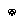
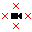
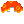
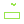
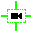

# Grog's Garage

A collection of random entities and other bits I've coded for various maps, in one convenient place.
Things will be ported as the projects they're a part of are released, for now this helper just has some utility entities/vanilla edits used in SSC4.

## Entities

###   Date Counter Controller
Sets various counters based on how far the current time is from a specified date.

###  Death Redirect Controller
Instead of dying, teleport the player to the specified room when a flag is active.

###  Entity Cull Controller
Disables entities within a given radius around the camera center. Useful for reducing lag in large/complex rooms.

###  Falling Lava
Lava that starts at the top of the screen and falls down.

###  Set Flag If Entity Exists
Sets a flag if the given entity type exists in the current room.

###  Flag When Player Collide Controller
Sets a flag to true if the player is currently colliding with a given type of entity.

###  Force Camera Update Controller
Sets `Player.ForceCameraUpdate` to true every frame.

## Triggers

### Boost Trigger
Adds/multiplies the player's speed in the given direction.

### Counter Flag Trigger
Sets a flag given a prefix and a counter's value.

### Lookout Blocker (Flag Toggled)
A lookout blocker that only works if the given flag is set.